# Smart Ranch App Usage Guide

Welcome to the **Smart Ranch System**, a comprehensive tool designed to help you manage your ranch operations efficiently! This guide provides an overview of the key features of the application, incorporating visual examples of the application in action.

## 1. Authentication
The journey starts at the login screen. You can sign in using your credentials to access the secure dashboard.
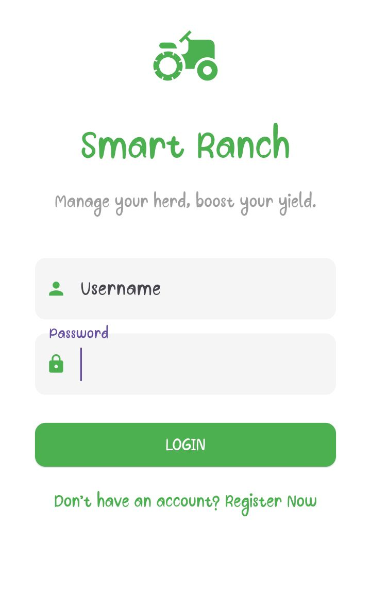

## 2. Dashboard Interface
The Home Dashboard gives you a quick snapshot of your farm's performance, summarizing operations, tasks, and vital statistics.
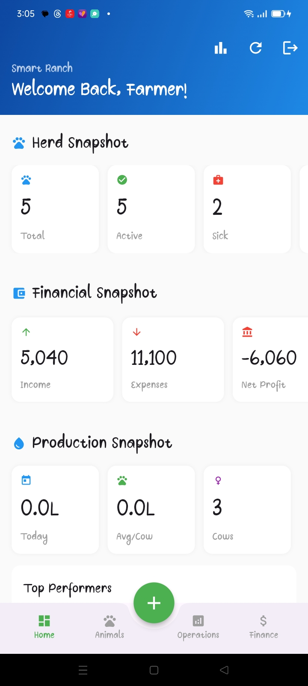
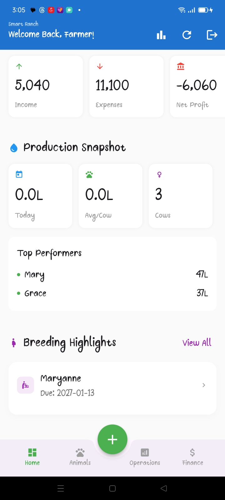

There is also a convenient quick-action menu (accessible via buttons) for performing frequent tasks on the go:
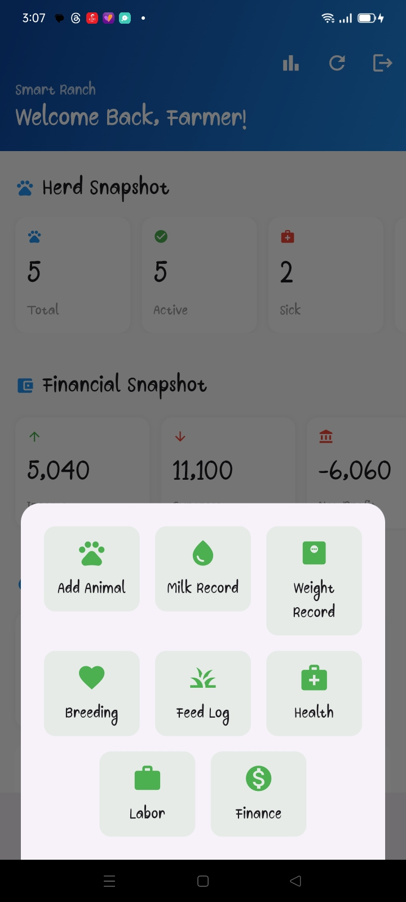

## 3. Animal Management
Easily keep track of all the animals on your farm with the Animal Inventory system. View a complete list or drill down into specific animal details.

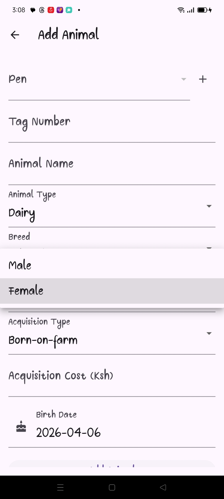

## 4. Financial Records & Transactions
Monitoring profitability is crucial. Use the Finance module to review income, track expenditures, and dive into specific transactions.
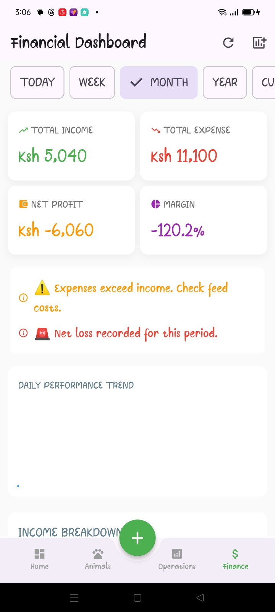
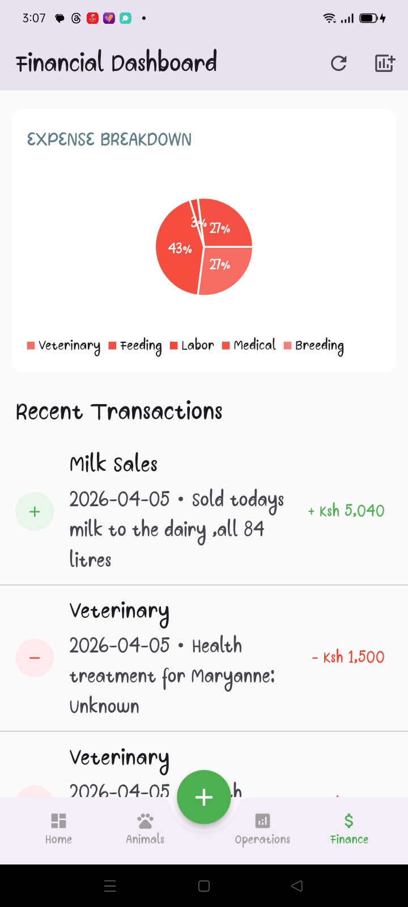
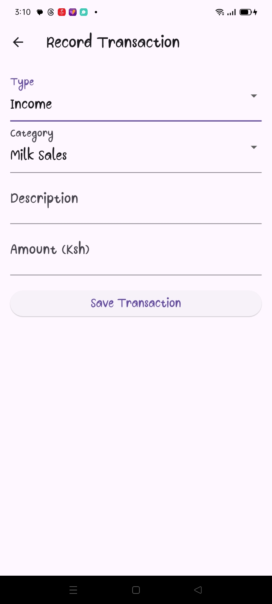

If you need to log a new purchase, sale, or expense, the Record Transaction page makes it simple:

## 5. Operations & Production
You can capture daily records, such as milk production, straightforwardly to maintain accurate yields and histories:

Dive into other granular operational modules as needed, covering various activities across the ranch:
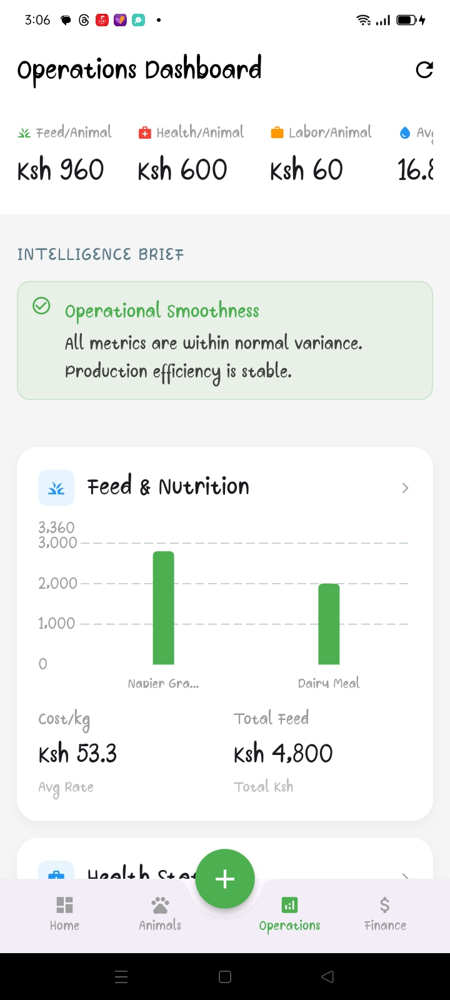
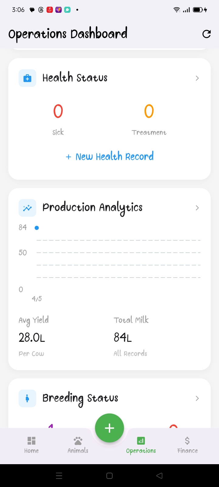
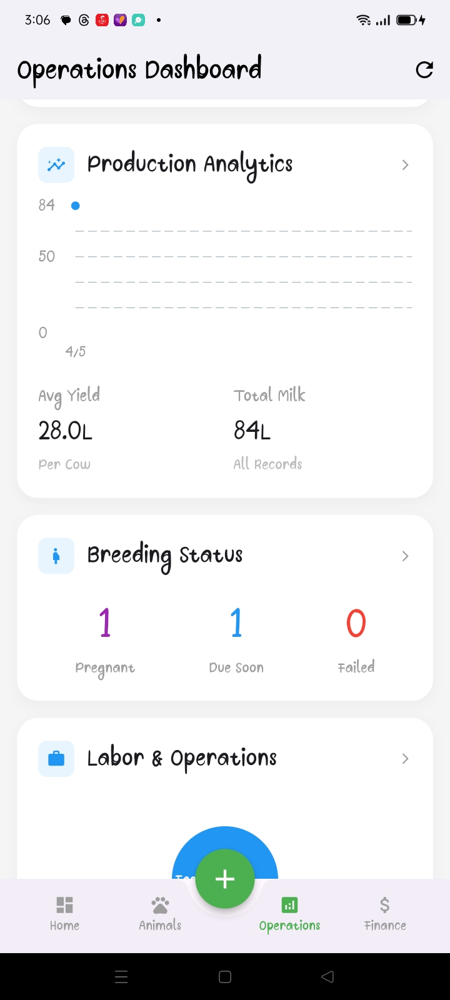
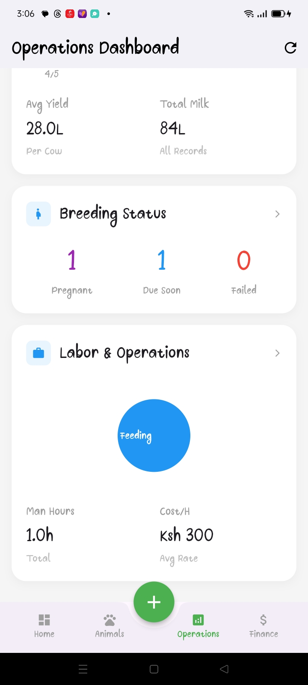

---
*Created automatically to document the application flow based on project images.*
